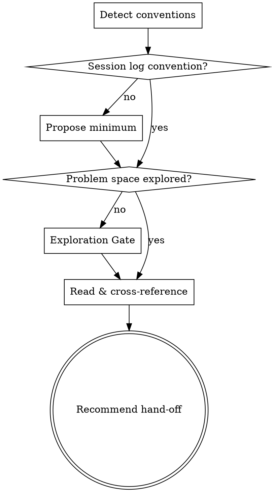

# Orient Claude

Session orientation skill. Establishes where a project is and what to do next, before any implementation work begins.

## When to Use

Invoke explicitly when:
- Starting work on a project after a break
- Picking up a new project for the first time
- Unsure what the next step is
- User says "orient", "where are we", "what's next", or similar

Do NOT auto-invoke at session start. User must request it.

## Flow

## Gate 1: Detect

Detect what conventions exist. The user's repos vary — there is no single hierarchy to enforce. Look for:

- **Top-level living plan**: `PLAN.md` (sometimes with `PLAN-ARCHIVE.md`) or just `README.md`.
- **Session logs**: `session_logs/` at the repo root, or `docs/session_logs/`. Files named `YYYY-MM-DD_<topic>.md` or `YYYY-MM-DD-<topic>.md`. Both locations exist in the wild — accept either.
- **Design docs / implementation plans**: `docs/plans/YYYY-MM-DD-<topic>.md`.
- **R package layout**: `DESCRIPTION`, `NAMESPACE`, `R/`, `tests/testthat/`, `man/`, optionally `src/`, `vignettes/`.
- **`targets` pipeline layout**: `_targets.R`, `_targets/`, `scripts/`.
- **Quality reports**: `quality_reports/`.

Report what was found in 3–5 lines. Do **not** propose a doc-hierarchy template — conventions should grow from need, not from a skeleton.

**Minimum scaffolding**: if there is no session-log convention at all, propose creating one (`session_logs/` at the root, or `docs/session_logs/` if `docs/` already exists) and offer to write the first log capturing initial state. That is the only scaffolding this gate proposes. Anything else (`PLAN.md`, `docs/plans/`) is the user's call as the project grows.

## Gate 2: Problem Exploration

Check whether the problem/design space has been explored for the current area of work.

**Signs exploration is needed:**
- User is unsure about approach or trade-offs
- New analysis or feature with no prior design doc and a non-trivial decision pending
- Recent session log flags an open question or fork in the road

**If exploration needed:**
- Hand off to `superpowers:brainstorming` for structured exploration before any code is written.
- For an analysis decision, the questions to surface are typically: causal/biological model, comparator group, threats to inference, what would falsify the result.
- Capture the resulting decision in a new `docs/plans/YYYY-MM-DD-<topic>.md` (if the project uses that convention) or in a session log.

**Signs exploration is done:**
- A design doc or session log records the chosen approach
- User confirms they know what they want and why
- Open questions are explicitly listed as deferred, not unresolved-by-accident

## Gate 3: Orientation

Read what's there in priority order:

1. **`PLAN.md`** if present, otherwise **`README.md`** — overall scope and current status
2. **Most recent session logs** (`session_logs/` or `docs/session_logs/`) — read the latest 1–3 to pick up where work left off; pay attention to the "what's still open" sections
3. **`docs/plans/`** if present — recent design docs that may not yet be implemented
4. **`git log --oneline -20`** — what was last touched
5. For R packages: skim `DESCRIPTION` and `NEWS.md` for current scope

Present a brief summary:
- What this project is, in one sentence
- What was last worked on (per latest session log + git)
- What's still open (per session log "open items" or `PLAN.md` TODOs)
- Anything that contradicts itself across these sources — flag it explicitly

## Hand-off

Based on orientation, recommend the next skill:

| Situation | Recommend |
|-----------|-----------|
| Feature needs design decisions | superpowers:brainstorming |
| Design exists, needs impl plan | superpowers:writing-plans |
| Plan exists, ready to code | r-package-tdd or relevant implementation skill |
| Open questions in design or session log | Return to Gate 2 (exploration) |
| Everything done | superpowers:finishing-a-development-branch |

State the recommendation clearly and let the user confirm before proceeding.
